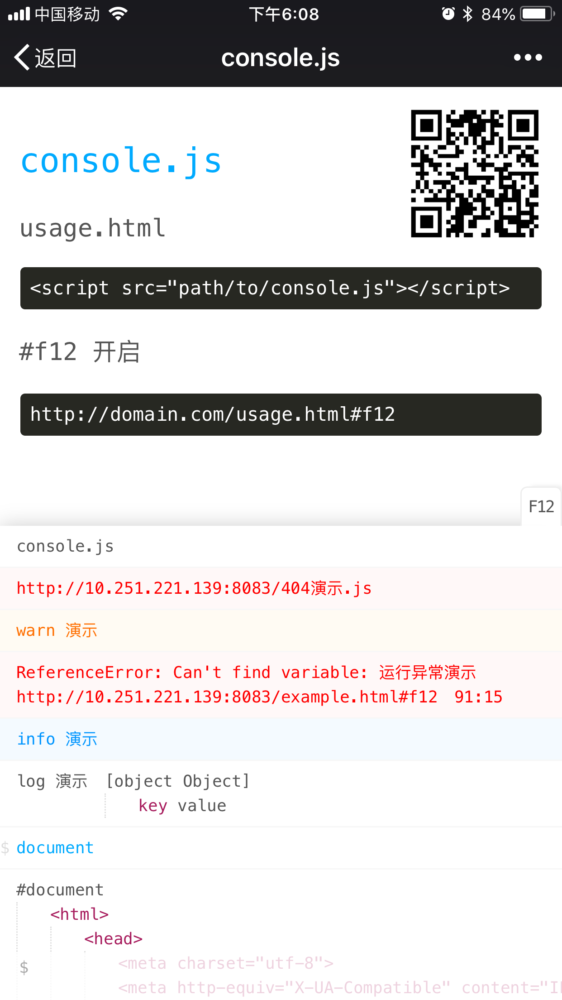

# console.js
移动端浏览器webview调试

## 用法
1. 引入 [console.js](https://wusfen.github.io/console.js/dist/console.js)  
```html
<script src="path/to/console.js"></script>
```

2. 需要调试时，在`url`上加上`#f12`即可开启
```css
http://domain.com/usage.html#f12
```

## 注意
hash路由可用以下代替
```javascript
url#/page#f12    url##f12    url#/#f12    url?f12    url?k=v&f12
 ```

## 加载器
[console.loader.js](https://wusfen.github.io/console.js/dist/console.loader.js) 
这不是必须的，但它积体会小很多，```#f12``` 时才会自动去加载 ```console.js```  

```html
<!-- 把两个文件放在同一目录 -->
<script src="path/to/console.loader.js"></script>
```
或者
```html
<!-- console属性 指定 console.js 的路径 -->
<script src="path/to/console.loader.js" console="path/to/console.js"></script>
```

## 演示
https://wusfen.github.io/console.js/example/example.html  
  
