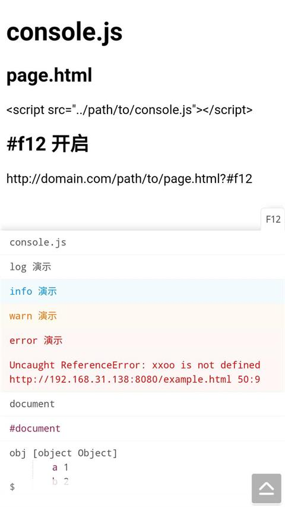

# console.js

**page.html**
```html
<script src="../path/to/console.js"></script>
```

**#f12 开启**
```
 * 使用方法
 * http://domain.com/page.html#f12
 * hash路由使用以下方式
 * http://domain.com/page.html##f12
 * http://domain.com/page.html#/#f12
 * http://domain.com/page.html?f12
 * http://domain.com/page.html?key=value&f12
```

  
